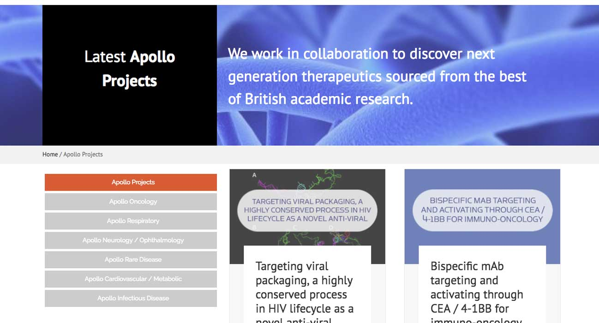
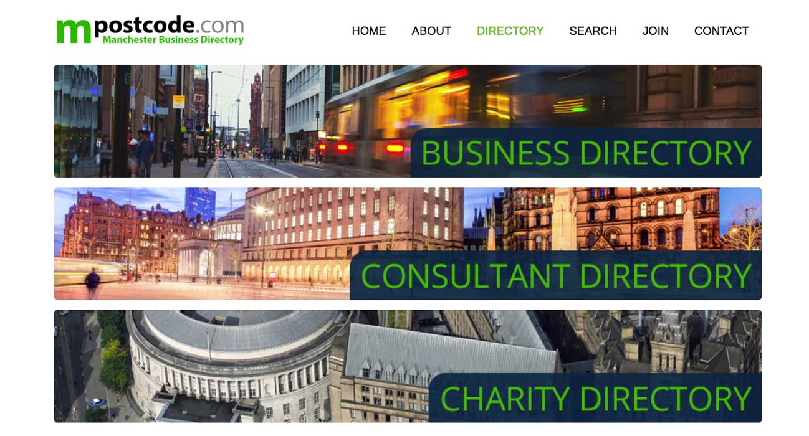
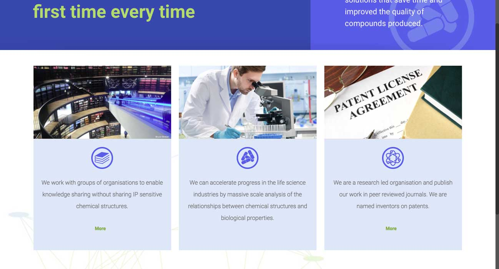
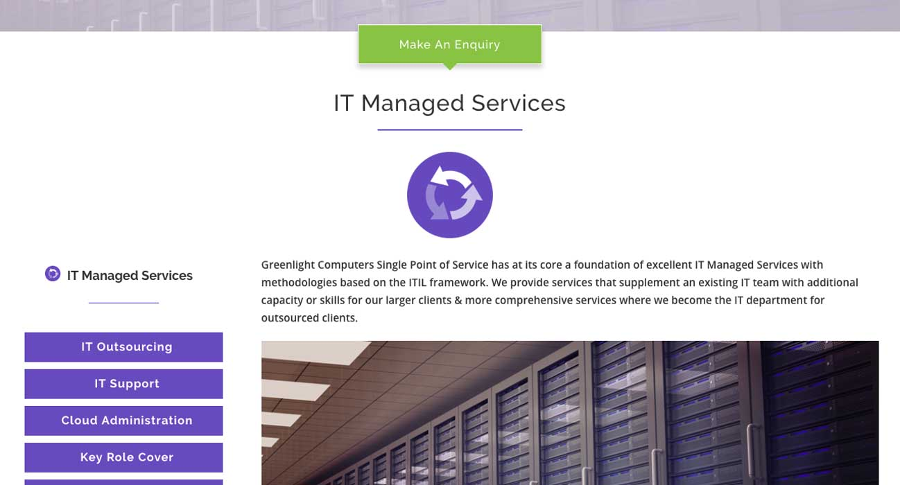
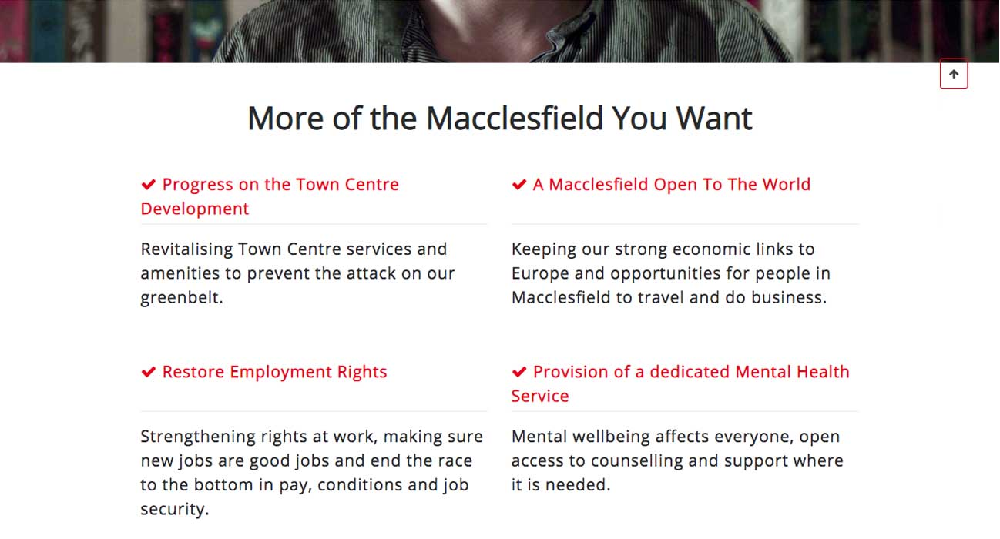
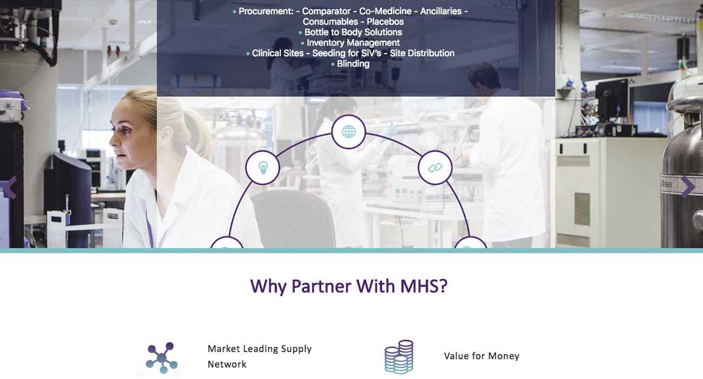

***

I am just starting on a process. For years, I was working as a maintainer, keeping old legacy websites going or using generic templates. From 2018, I am hoping to design better from the beginning with a full consideration of the whole lifecycle of a project.

Here are some of the previous websites that I have designed. (As soon as I can I will design a Gatsby page with React components to properly showcase my projects and explore how we can use taxonomies in the project...)

***

##[Apollo Therapeutics](https://apollotherapeutics.com/)
The clients have a team of contributors from all over the world, so I designed as much of the website content to be editable through the dashboard as I could, whilst keeping integrity. I created nested custom fields & post types so that author, project, references & other sicentific data could be indexed, including downloadable pdfs. As part of the project, we explored web-friendly ways to use scientific symbols. The designer wanted to return to the tradional bars on the menu, as the client wanted the site to look like other older sites...

####Technology: Wordpress, Plugin: using Advanced Custom Fields
####Challenge:

***

##MPostcode (https://www.mpostcode.com/)  

The client wanted to create a business directory service that only Manchester businesses could join, using Wordpress (so their admin could access it). They also wanted a way for the business user to be able to signup & enter a member's area once they were manually approved

####Technology: Wordpress, Plugins: using Gravity Forms & Gravity View, Social Media Login (OAuth)
####Challenge: 

***

##Medchemica (https://www.medchemica.com/)

One of the Alderley Park success stories, Medchemica wanted a simple site to offer their services to specialist customers and tell their shareholders what they were doing. 

####Technology: Wordpress, Plugins: using Gravity Forms & Gravity View, Social Media Login (OAuth)
####Challenge: Using Server-side caching

***

##Greenlight Computers (https://www.greenlightcomputers.co.uk/)

The flagship

####Technology: Wordpress, Plugins: using Gravity Forms & Gravity View, Social Media Login (OAuth)
####Challenge: Using Server-side caching

***

##Your Macclesfield (https://yourmacclesfield.uk)

Snap Election - My Labour Candidacy

####Technology: Wordpress, Plugins: using Gravity Forms & Gravity View, Social Media Login (OAuth)
####Challenge: Using Server-side caching

***

##Matrix Healthcare (https://matrix-healthcare.com/)

Matrix Healthcare asked 

####Technology: Wordpress, Plugins: using Gravity Forms & Gravity View, Social Media Login (OAuth)
####Challenge: Using Server-side caching

***

