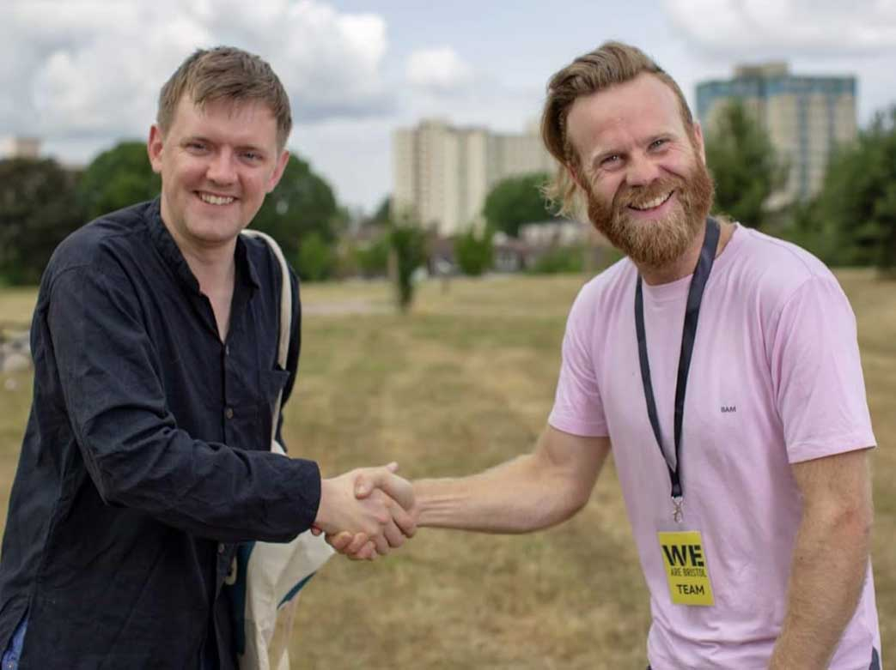

I am just starting on a process. 

For years, I have worked as a maintainer, keeping old legacy websites going or using generic templates. In 2018, I am aiming to comprehensively design better from the beginning with a full consideration of the whole lifecycle of a project.

Here are some of the current projects and previous websites that I have designed. As soon as I can, I will create a showcase page (designed with React Sketch App) to properly organise and display my projects in category and tags...

***

##[Apollo Therapeutics](https://apollotherapeutics.com/)

The client - a collaborative venture between three major universities - have teams of contributors from all over the world, so I designed as much of the website content as possible to be editable through the dashboard, whilst keeping integrity of the site. I created nested custom fields & post types so that author, project, references & other scientific data could be uploaded by the client, including downloadable files & links. The designer wanted to return to the traditional bars on the menu, as the client wanted the site to look like other older sites, so the exercise became about how we could make it look older (with certain conventions from pre-2010) whilst keeping newer tech.

####Technology: Wordpress, Plugins: using Advanced Custom Fields
####Challenge: As part of the project, we explored web-friendly ways to use scientific symbols (similar to using International Phonetic Alphabet symbols for Speech & Language website previously).

***

##MPostcode (https://www.mpostcode.com/)  

The customer wanted to create a business directory service that only Manchester businesses could join, using Wordpress (so their admin could access it). They also wanted a way for the business users to be able to sign-up & enter a member's area (with all sorts of controls) but only once they were manually approved by the sales team. 

####Technology: Wordpress, Plugins: using Gravity Forms & Gravity View, Social Media Login (OAuth).
####Challenge: Using Wordpress as a CRUD system and linking this to a secure members area.

***

##Medchemica (https://www.medchemica.com/)

One of the Alderley Park success stories, Medchemica wanted a simple site to offer their services to specialist customers and tell their shareholders what they were doing in a simple CMS. If I were working with them now, I would suggest trying non-PHP solutions, such as Gatsby JS.

####Technology: Wordpress, Plugins: using Gravity Forms & Gravity View, Social Media Login (OAuth)
####Challenge: Using Server-side caching & Cloudflare to keep size down and speed of site when users liked to edit fields etc. 

***

##Greenlight Computers (https://www.greenlightcomputers.co.uk/)

The IT Firm's flagship website was designed to show Single Point of Service (which offers Businesses comprehensive IT Management packages). Although the company offer was quite wide-ranging, the website aimed to route customers to the support they needed.  There was also a quite extensive matrix of Case Studies and Services. As the majority of the visitors were existing customers looking to access services, we embedded ways to log a call, logins, and to remote access as quickly as possible.

####Technology: Wordpress, Plugins: using Gravity Forms & Connectwise
####Challenge: Integrating Connectwise Customer Service Software with 

***

##Greenlight People (https://www.greenlightpeople.co.uk/)

I embedded a react component job-search tool into a Wordpress site and built a website (that in UI/UX design terms) directed "the Right People for The Right Roles" as quickly as possible, and encouraged users to login. I linked the jobs to Google Maps APIs and other services, to embed some of the links to other job sites and businesses. The aim was to use keywords and social media integration to make the website more findable.

####Technology: Wordpress, Plugins: using Gravity Forms, Advanced Custom Fields, Reactive Pro & Hotjar 
####Challenge: Integrating Connectwise Customer Service Software with a Wordpress Website. 

***

##Your Macclesfield (https://yourmacclesfield.uk)

In 2017, after the Prime Minister called a snap election, I was nominated to stand as the Parliamentary Candidate for Labour in Macclesfield. I quickly scaffolded a website that put my key election pledges and full-width page images to the fore. This was a case of less bells and whistles - direct offer and connection with the electorate. 

####Technology: Wordpress
####Challenge: Quickly and simply put the main language on a website.

***

##Matrix Healthcare (https://matrix-healthcare.com/)

Matrix Healthcare asked for a SPA (Single Page Application), using modals and animations to display the data without moving away from the main site. We wanted to use authentic images and vector images to give depth to the design, and to layer animations onto the website. We investigated how we could keep findability and searchability for the site when there was no about or contact pages, and how we can enforce Google Tags & analytics onto different parts of a page. 

####Technology: Wordpress, Plugins: using Yoast SEO 
####Challenge: Securely using custom SVG animations in a Wordpress website.

***

