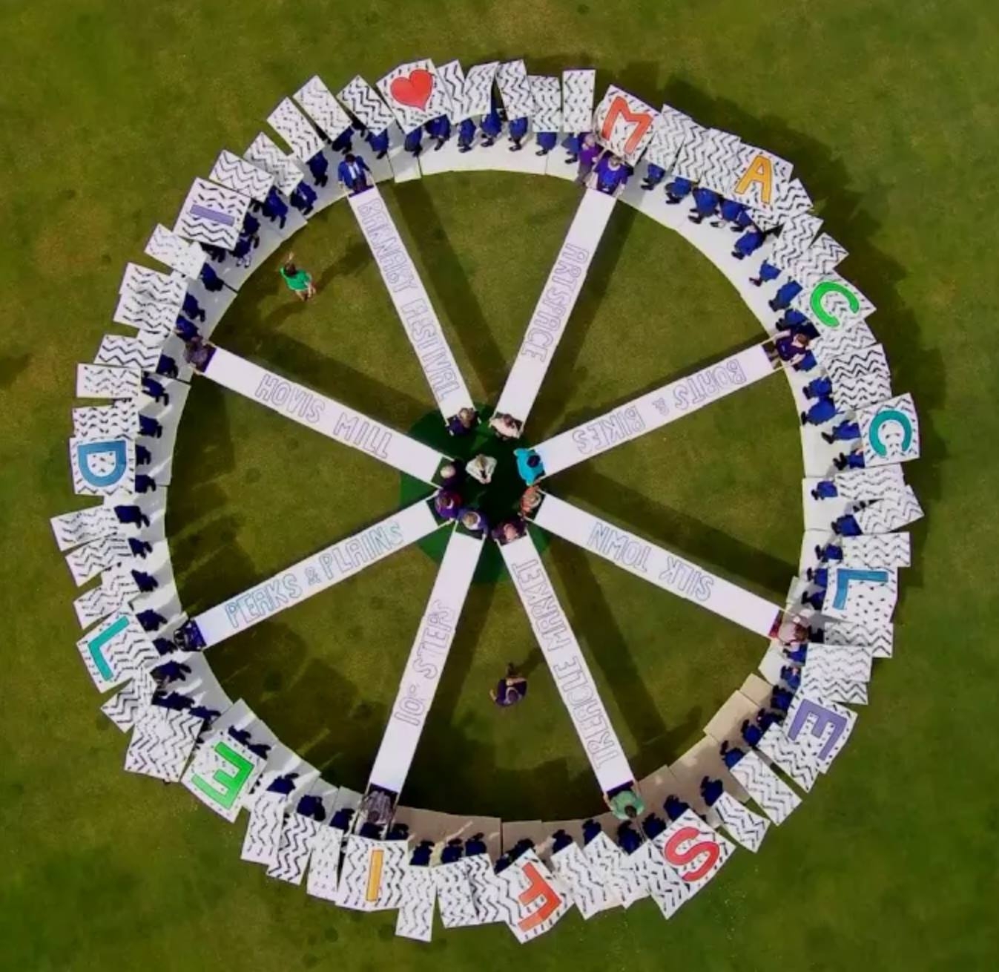

##Membership

* [LevelUp Tuts](https://www.leveluptutorials.com/tutorials)  including NextJS/Wordpress REST API, Gatsby, ReactJS, JSS & CSS Animations & Transitions

* [Lynda.com](https://www.lynda.com/) - including Javascript, OOP & Functional Programming Patterns, Angular, React, using Typescript

	* Git Essential Training Up and Running with AngularJS 
	* Foundations of Programming: Object-Oriented Design 
	* Up and Running with PhoneGap 
	* Build JavaScript Essential Training 
	* Up and Running with Backbone.js 
	* Foundations of Programming: Fundamentals 
	* Foundations of Layout and Composition
	* Up and Running with Bootstrap 3 Blogging for Your Business

* [LaraCasts](https://laracasts.com/) - mainly Laravel & PHP Development 

	* Laravel From Scratch 
	* Let's Build With TDD
	* PHP Practitioner
	* Laravel Fundamentals 
	* Professional PHP Workflow in Sublime Text 3
	* CSS Grids For Everyone
	* Webpack For Everyone
	* Object-Oriented Bootcamp
	* SOLID Principles in PHP

* [TutsPlus](https://code.tutsplus.com) - Generalist Development
	
	* Set Up WordPress Multisite
	* Hands-On Angular
	* Better Web Apps with AngularUI
	* Go Further With WooCommerce Themes
	* Creating Angular Directives
	* Understanding the CSS Box Model
	* Mobile Apps With Ionic and Firebase
	* PHP OWASP Security
	* JavaScript for PHP Developers
	* PHP Object Oriented Programming Fundamentals
	* PHP Fundamentals
	* Build a CMS in Symfony 2
	* AngularJS for Test-Driven Development
	* Agile Design Patterns
	* Real-Time Web Apps With AngularJS and Firebase
	

* [Udemy](https://www.udemy.com/)

	* The React practice course, learn by building projects.
	* React 16 - The Complete Guide (incl. React Router 4 & Redux)
	* GraphQL with React: The Complete Developers Guide
	* Modern React with Redux
	* How I Hit #1 on Google: The 2018 Complete SEO Course

##Relevant Training

* __Full-Stack Web Development (with Angular)__: Coursera / Hong Kong University - May 2016

##Formal Education

* __University of the West of England__: PGDip Art, Media & Design by Project: Sep 2011 - Mar 2014  
* __University of Bristol__: BA (Hons.) 2:1 Drama Oct 2002 - Jun 2006.
* __Fallibroome Academy, Macclesfield__: A levels: English Language [B] Theatre Studies [B] History [C] 
* GCSEs: English [A/A], Mathematics [A], Science [A/A], Statistics [A], Graphic Design [A], Drama [A*], French [A], History [A*] RE [A]

