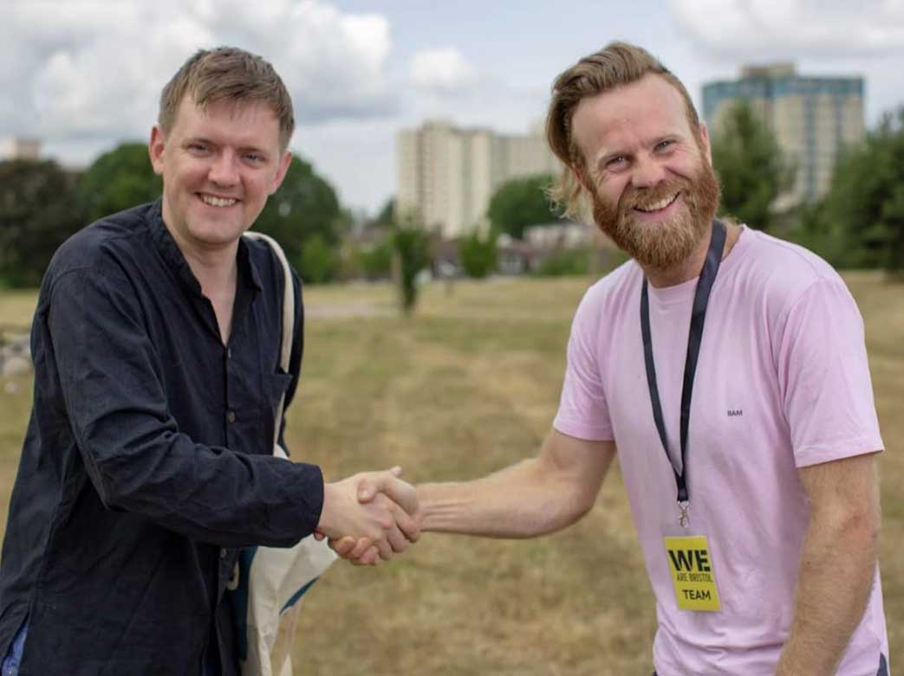
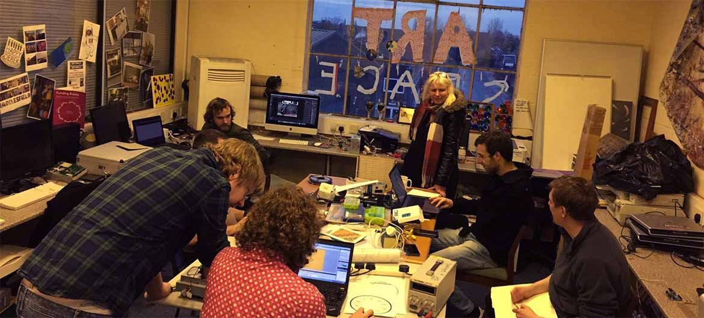
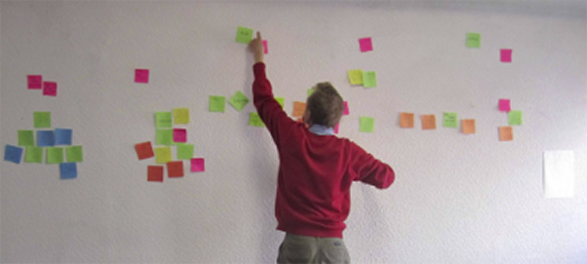

**Neil Puttick** is a Digital Creative Producer and Web Developer. He offers a strong working knowledge of digital development to make successful projects.

---

* __I have 3 years vocational hands-on experience__ creating cutting-edge digital presence for SMEs & individuals in Science & Industry, producing responsive web apps and sites for projects and promotional campaigns.

* __I have worked independently and in small teams, but always for the client__ I have been responsible for building, maintaining & fixing legacy Wordpress and PHP, as well as building custom themes & plugins for Wordpress that use Laravel or React for functionality. I have used Wordpress theme ecologies like [Roots](https://roots.io/) to provide full-spec, highly performant Wordpress themes, but also creating Member's Areas, Intranets, CRUD, quotation systems to extend what Wordpress could do.

* More recently, __I have started to use my love Full Stack JS, particularly React__ to make and manage dynamic, secure, rich-content, light-weight web-apps; offering customers the chance to migrate older websites to use some future-facing technologies, using FAN (Firebase) Stack and JAM Stack (Javascript, APIs, Markup) to improve the client & contributor experience. In converting legacy Wordpress sites, I am looking to let users continue to have the usability & accessibility they expect from the great plugins and services they have been used to.

* __I am investigating how to take CMS further__ to improve performance, security & user-experience. My focus is on using Gatsby.JS, Netlify-CMS & Contentful investigating Serverless JAM (API & Saas) Stack. I am also investigating how we improve user experience in Wordpress, but I am also looking at how .NET Frameworks, like Umbraco can work alongside this. I have moved my research to technologies that will enable a holistic approach - seamlessly linking analytics to design so that you can showing the user what they want to see first.

* __I have a strong methodical workflow__ quickly and reliably scaffolding beautiful future-proof work using NodeJS to generate and manage sites: with NPM, Yarn, and Gulp.  

*  __I demonstrate good organisational & communication skills in my work__ and pay attention to detail. I am used to working on multiple projects simultaneously and managing priorities.

* __I use strict testing and debugging__ and as an aim have set about creating total DRY efficiency in my workflow. 

* __I also have an arsenal of tools to code quicker and make more:__ 
    * I use Visual Code Studio & Sublime with extensions & shortcuts, like Emmet.
    * I build cleaner code using ES6 & 7 with Babel compiler, removing HTML clutter & focusing on semantic markup to improve accessibility. 
    * I aim to make cleaner design: using JSS, SASS preprocessor & adopting newer CSS conventions like Grid Layout or Accelerated Mobile Pages (AMP) to remove unnecessary time-consuming code and optimise sites.
    * I make sure my work is fully documented and versioned with GIT version control from the command line.

* __I relish a challenge__ and see many opportunities to make great things with web technologies, extending into mobile and other devices with tech like PWAs.

* __I love working with others to make a product or service. I would like to work as part of an agile team__ or work within an agency, with project management structures & objectives.  In my previous role, I worked with a designer & SEO specialist, so know how to work with a team, and I have used OOP or functional programmatic design to plan & rationalise. However, I would like to work within a system of continuous deployment & iterative approach to get best practice for UI & UX. 

 * __I see my job to enable others__ - I ensure client and team have access and the flexibility to work the way they want. I have experience making dashboards, social-media connected sites anyone can use, with accessibility integrated into the design. 
 
* __I am easy to contact__. I know how to liaise with, advise and teach stakeholders. 

* __I can explain what I am doing__ I can explain work to clients in a straightforward way, and use resources with plenty of communities, plugins and support.

* __I am pragmatic__: I am driven to find the correct fit and always willing to research and learn the best solution for the job (with Stack Overflow, Youtube, or online tutorials). From using SMS on a website for outdoor users to using PHP & legacy frameworks for reliability, I look to combine ease of use with the best technologies available.

* __I will go the extra mile__ As part of SMEs, I am used to covering many different roles and have experience working with freelancers / contractors to work on product:

	* Forging high-quality SEO-optimised words.
	*  Meticulous eye for detail and systematic approach, working efficiently and independently to deadline.
	*  Cross-industry Research gathering and Report-writing. 
    *  Accomplished video and photo-editor for product promotion and industry showcases. 
	*  Experience of representing companies: Writing press releases, newsletter/magazine copy, liaising with national, local & industry press. 
    * I have been highly commended as a host for organising events and groups. 
    * Excel in customer/client relations 
    * As a content producer, I work with knowledge that CONTENT IS KING and client product and message are the priority.

* __I am an active part of communities, online and face-to-face__ As someone who is always learning and benefits from shared knowledge, but also to improve the collective effort for a better web.

